This plugin allows efficient management of users, roles and capabilities. Create, edit and delete user permissions faster and easier.

### Features:
- Lists available roles;
- Add custom roles;
- Delete custom roles;
- Permissions based on custom roles;
- User management;
- Adds more than one role for a user;
- Set default role for user without roles;
- Access to admin menu by role;
- Auto add role to new users;
- Show/Hide admin bar to specific roles;
- Show/Hide Widgets on admin/front to specific roles;
- Show/Hide individual sidebar widgets to specific roles;
- Content access by user role;

### Installation
1. Upload plugin folder to the `/wp-content/plugins/` directory
2. Activate the plugin through the 'Plugins' menu in WordPress
3. Enjoy

### Developing
To contribute to the plugin, open your favorite terminal and navigate to the root directory of the plugin. 
Type the command: `npm install`.

After the dependencies are installed, type `gulp watch` and start developing.

Source files to scss: `assets/src/sass/`

Source files to js: `assets/src/js/`

### Screenshots
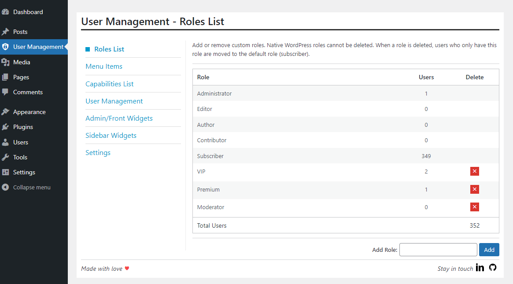
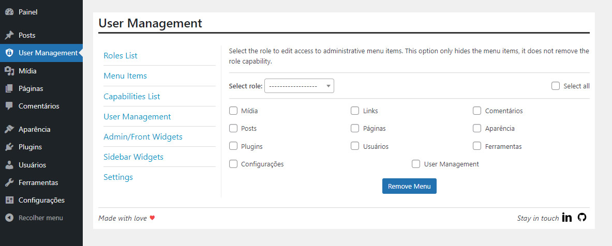
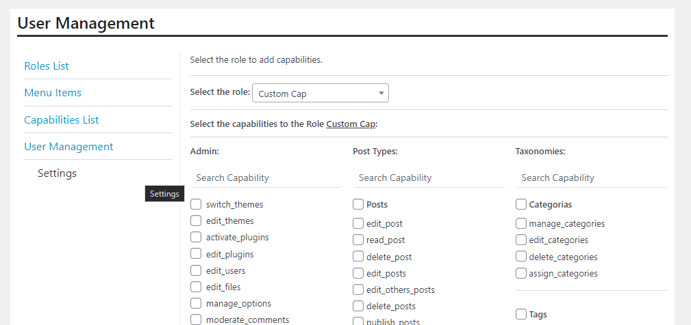
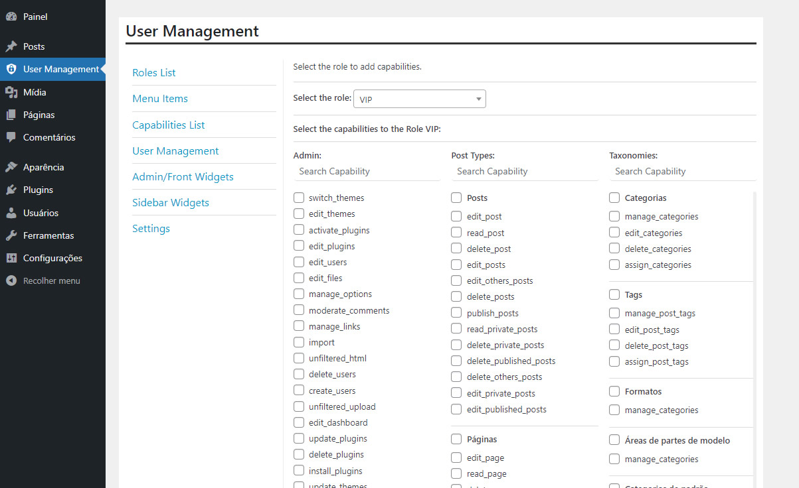
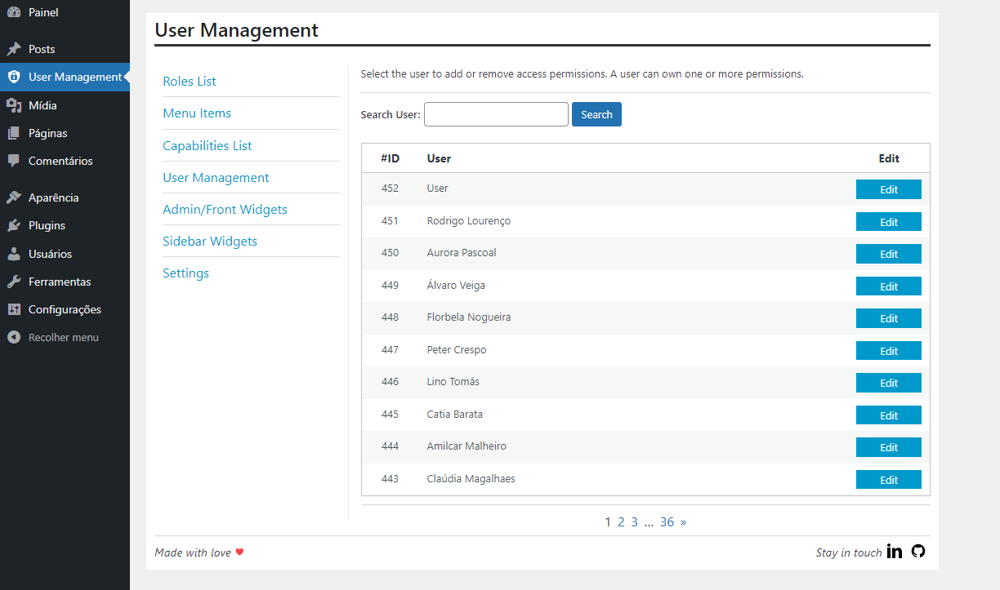
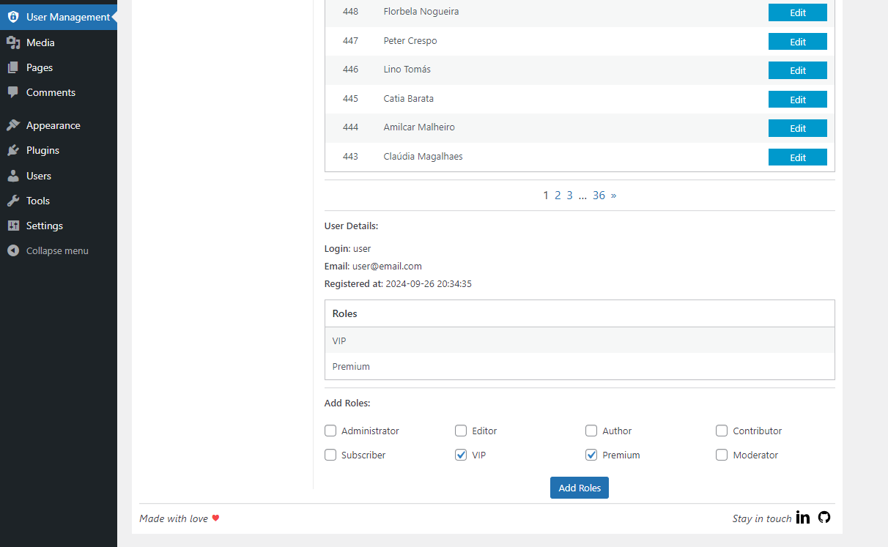
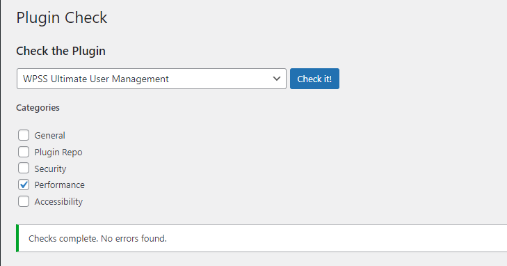
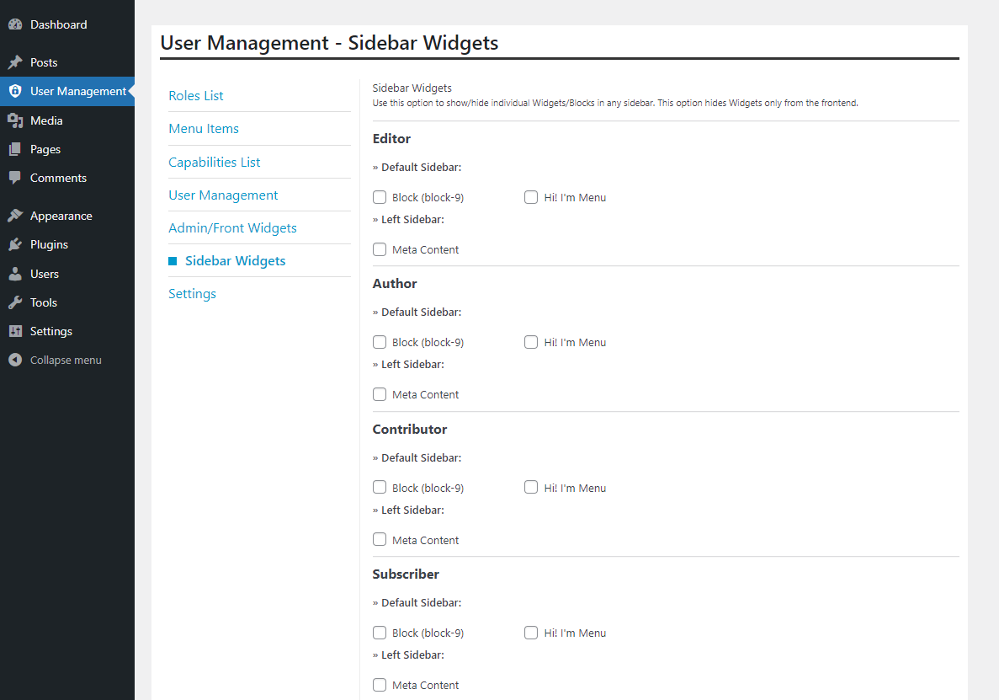
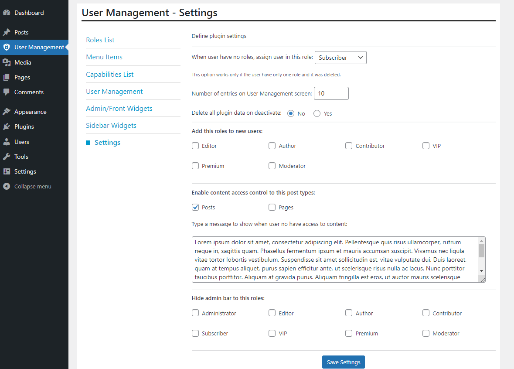
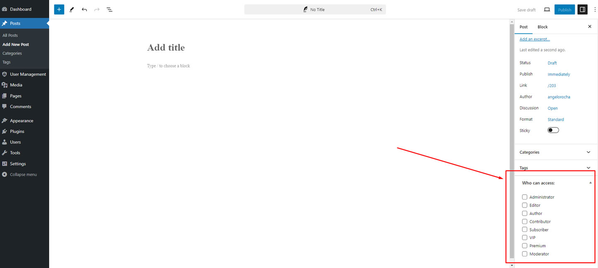
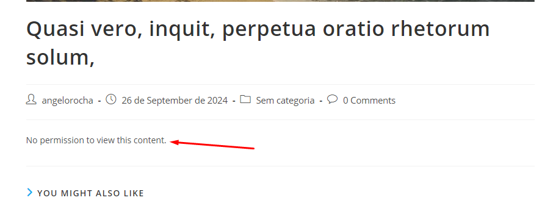
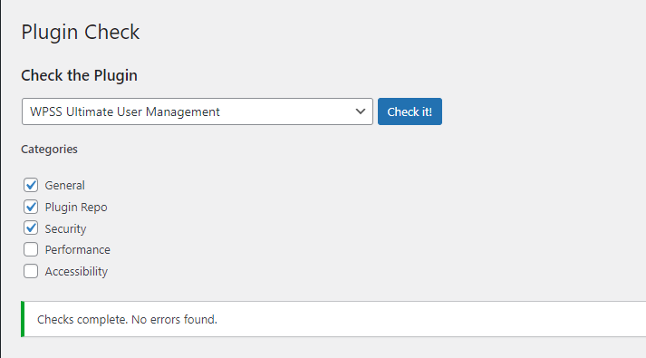

