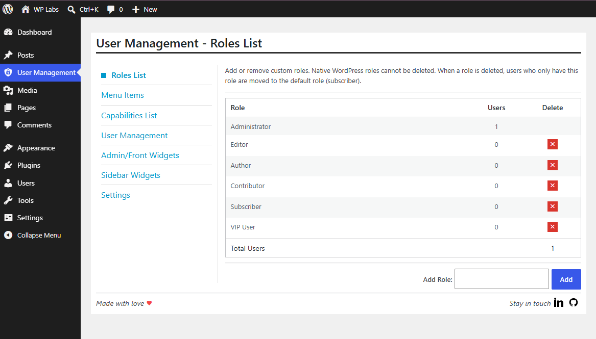
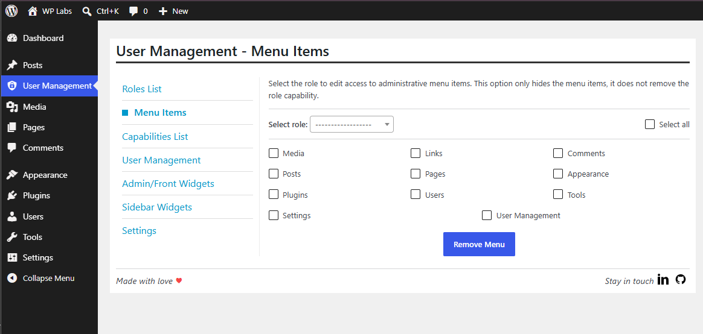
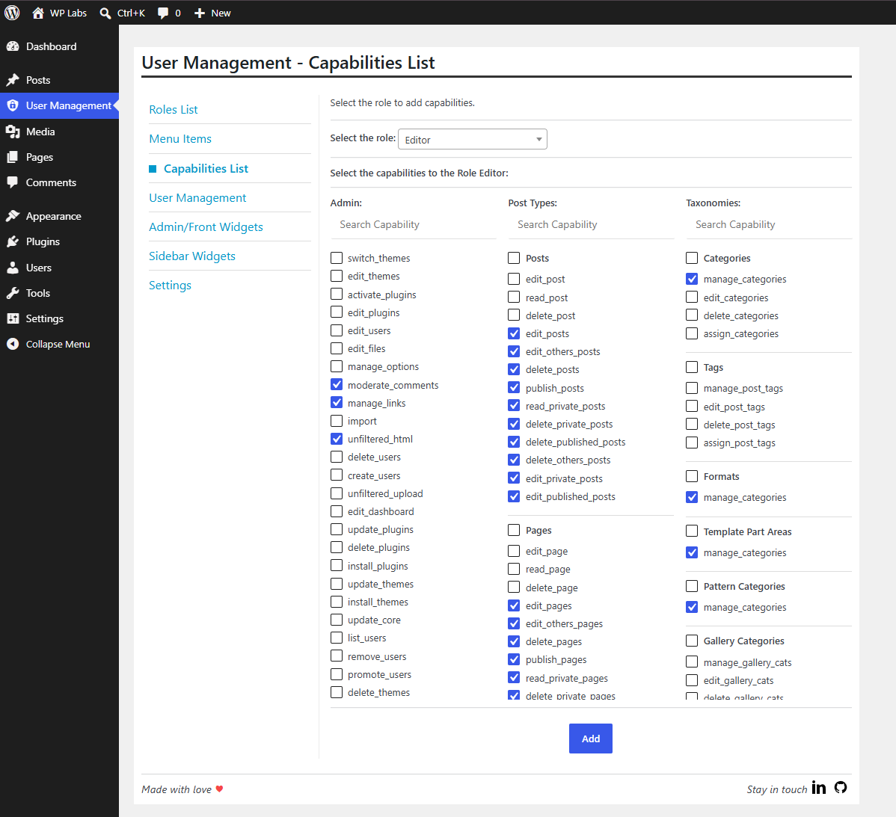
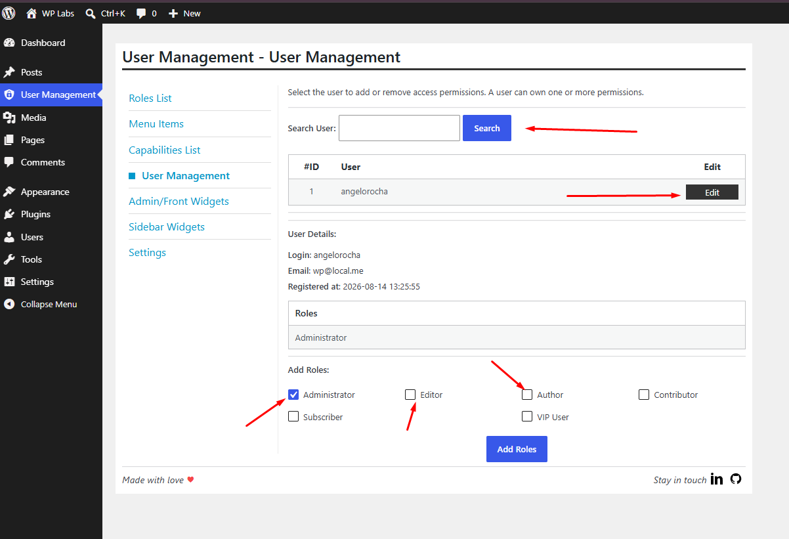
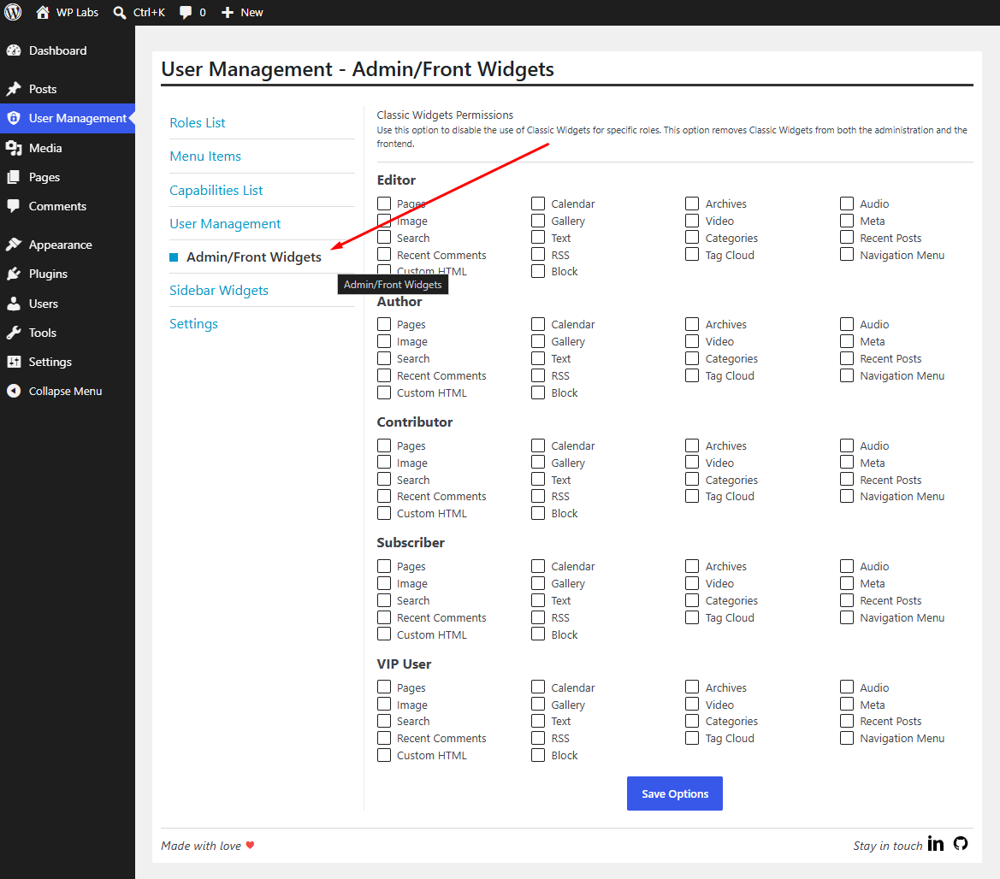
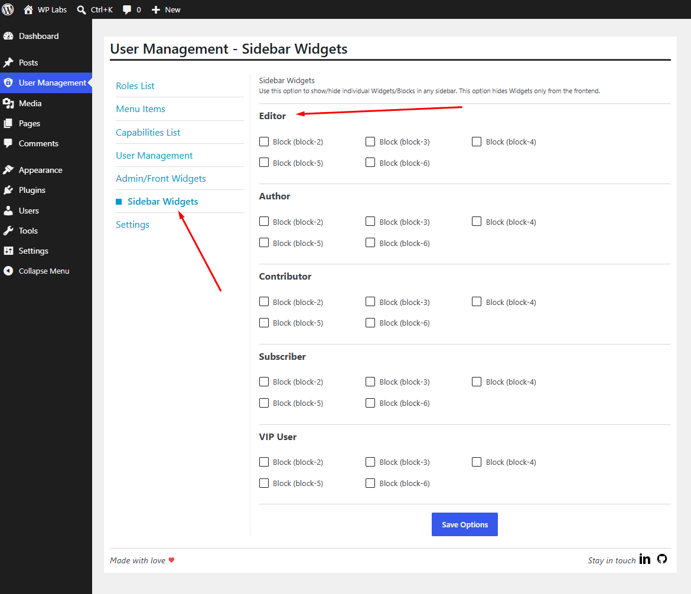
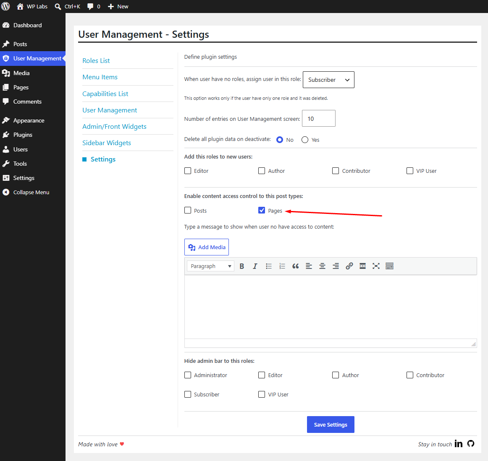
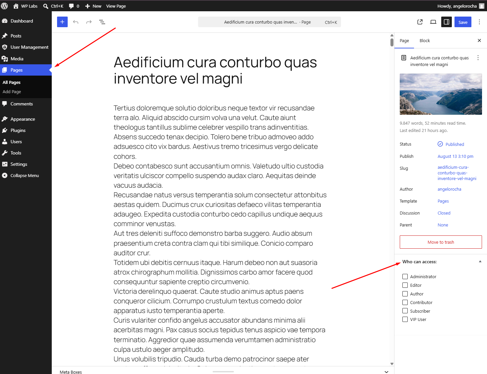

# RoleCraft: User Access Control – Roles, Capabilities & Content Restriction

> **The ultimate, lightweight user management and access control solution for WordPress.**

**RoleCraft User Access Control** is a lightweight and comprehensive access control solution for WordPress that gives administrators precise control over **what users can do, what they can access, and what content they can see**.

Manage custom user roles and capabilities, assign multiple roles to users, control dashboard menus and the admin bar, restrict widgets and sidebars, and protect content across posts, pages, and custom post types — without relying on multiple plugins or custom code.

Designed for **site administrators, developers, agencies, client websites, membership sites, LMS platforms, and custom WordPress projects**, RoleCraft User Access Control brings commonly scattered access-control features together in one clean and intuitive interface.

---

## 🔐 Key Features

### 🔐 Roles & Capability Management
Create and manage the permission structure of your WordPress installation without editing code.

* **Custom Role Management:** Create, edit, and delete custom user roles directly from the WordPress dashboard.
* **Granular Capability Management:** Add or remove individual capabilities from custom roles for precise permission control.
* **Multiple Roles per User:** Assign multiple roles to the same user from their profile.
* **Bulk Role Assignment:** Add or remove roles from multiple users at once.
* **Fallback Role:** Automatically assign a configured fallback role when users are affected by the deletion of a role.
* **Automatic Role Assignment:** Automatically assign one or more selected roles to newly registered users.

### 🛡️ Dashboard & Admin Access Control
Control what different user roles can see and access inside the WordPress administration area.

* **Admin Menu Permissions:** Control the visibility and access of dashboard menus and submenus by user role.
* **Admin Bar Visibility:** Show or hide the WordPress admin bar for specific user roles.

*Create cleaner, more focused dashboard experiences for clients, editors, contributors, members, and other user groups.*

### 🧩 Widget & Sidebar Permissions
Control access to classic WordPress widgets and sidebars according to user roles.

* **Widget Access Control:** Restrict widget visibility and editing permissions based on user roles.
* **Sidebar Permission Manager:** Manage role-based permissions for specific sidebar widgets across the frontend and backend.

### 🔒 Content Restriction
Restrict access to content based on user roles without requiring custom development.

* **Custom Post Type Restrictions:** Choose which post types can use content restrictions.
* **Per-Post Access Control:** Restrict individual posts and pages by selecting which user roles are allowed to view their content.
* **Custom Restriction Messages:** Configure personalized messages displayed when access to restricted content is denied using a built-in WYSIWYG editor.

---

## ⚡ One Plugin, Multiple Access-Control Layers

Instead of installing several separate plugins to manage roles, capabilities, dashboard access, widgets, and restricted content, **RoleCraft** brings these controls together in one focused solution. From **user permissions and administrative access** to **frontend content restrictions**, everything can be managed from a unified interface.

---

## 💡 Common Use Cases

* **Client Websites:** Give clients access only to the tools and dashboard areas they need.
* **Membership Websites:** Control access to content and functionality according to user roles.
* **LMS Platforms:** Separate administrative, instructor, and learner permissions.
* **Client Portals:** Create focused dashboard experiences with role-specific access.
* **Editorial Workflows:** Define precisely what different users and roles can manage.
* **Custom WordPress Applications:** Build granular permission structures without developing a custom access-control system from scratch.

---

## Installation
1. Upload plugin folder to the `/wp-content/plugins/` directory
2. Activate the plugin through the 'Plugins' menu in WordPress
3. Enjoy

## 🛠️ Development & Environment Setup

RoleCraft is built using modern WordPress standards, native Core APIs, and automated build tools.

### Prerequisites
* **WordPress:** 6.1 or higher
* **PHP:** 8.1 or higher

### Developing
To contribute to the plugin, open your favorite terminal and navigate to the root directory of the plugin. 
Type the command: `npm install`.

After the dependencies are installed, type `gulp watch` and start developing.

Source files to scss: `assets/src/sass/`

Source files to js: `assets/src/js/`

### Screenshots

